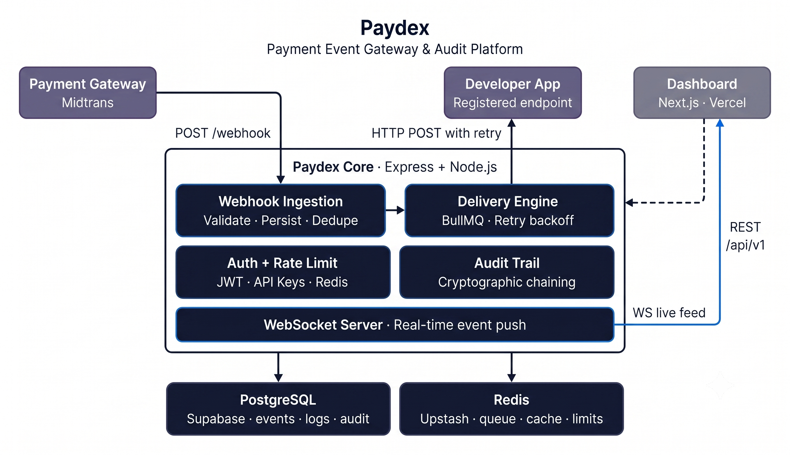

# Paydex

**Never lose a payment event again**

Paydex is a Payment Event Gateway & Audit Platform — a reliability layer that sits between payment providers and your application. When Midtrans fires a webhook, Paydex catches it, validates the signature, persists the event, retries failed deliveries, and gives you a real-time dashboard to see every event.

> **Live Demo:** Coming soon
>
> Demo credentials: `admin@paydex.dev / demo1234` and `dev@paydex.dev / demo1234`

## Architecture



## Tech Stack

| Layer         | Technology                       | Reasoning                                                           |
| ------------- | -------------------------------- | ------------------------------------------------------------------- |
| Frontend      | Next.js 16 + TypeScript          | App Router, server components, zero-config Vercel deploy            |
| Backend       | Node.js + Express 5 + TypeScript | Explicit middleware chain, non-blocking I/O for webhook concurrency |
| Database      | PostgreSQL 16 (Supabase)         | ACID transactions for audit chain writes, JSONB for payloads        |
| Cache / Queue | Redis 7 (Upstash)                | BullMQ backing store + rate limit counters + idempotency keys       |
| Queue         | BullMQ 6                         | Native exponential backoff, DLQ, job persistence                    |
| Auth          | JWT + bcryptjs                   | 15min access token, 7d refresh token, bcrypt cost 12                |
| Styling       | Tailwind CSS                     | Utility-first, dark mode                                            |

## Development Status

| Phase                              | Status         | Issues                                                  |
| ---------------------------------- | -------------- | ------------------------------------------------------- |
| Phase 1 — Planning & Documentation | ✅ Complete    | PRD, System Design, ERD, API Contract, 44 GitHub Issues |
| Phase 2 — Project Setup            | ✅ Complete    | Monorepo, CI/CD, Docker, ESLint, TypeScript             |
| Phase 3 — Backend                  | ✅ Complete    | All 20 backend issues closed                            |
| Phase 3 — Frontend                 | 🔄 In Progress | Issues #31–#37                                          |
| Phase 4 — DevOps                   | ⏳ Pending     | Issues #38–#42                                          |
| Phase 5 — Docs & Seed              | ⏳ Pending     | Issues #43–#44                                          |

## What This Project Demonstrates

**Distributed systems patterns**

- Gateway-agnostic adapter pattern — `IGateway` interface with `validateSignature()` and `normalizeEvent()`. Adding Stripe or Xendit requires implementing `IGateway` only, zero changes to core services.
- Async job processing with BullMQ — delivery queue with exponential backoff (1s → 2s → 4s → 8s → 16s), dead letter queue after 6 attempts, concurrency control.
- Real-time event streaming via native WebSocket — JWT-authenticated connections, per-user connection map, heartbeat detection.

**Data integrity and security**

- Cryptographic audit chaining — each audit entry hashes `SHA-256(prevHash + eventId + action + actorId + timestamp)`. Any tampering breaks the chain, verifiable at `GET /api/v1/audit-log/verify`.
- Idempotency — Redis `SET NX` as primary, PostgreSQL `SELECT FOR UPDATE` as fallback. Prevents duplicate processing under network retries.
- HMAC-SHA512 signature validation with `timingSafeEqual` — prevents timing attacks on webhook authentication.
- AES-256-GCM encryption for gateway credentials at rest.

**API design**

- Consistent response envelope across all endpoints: `{ success, data, error, meta }`.
- Cursor-based pagination — no OFFSET, scales with dataset size.
- Sliding window rate limiting via Redis ZSET pipeline — eliminates boundary burst vulnerability of fixed-window counters.
- Machine-readable error codes on all error responses.
- Swagger UI at `/api/docs` — interactive documentation, no auth required.

**Engineering practices**

- Monorepo with npm workspaces — shared TypeScript types across api and web packages.
- GitHub Actions CI pipeline with PostgreSQL and Redis services — lint, type-check, test, build on every PR.
- Conventional Commits + GitHub Flow — clean, traceable history.
- Unit tests (Jest + mocks) and integration tests (Supertest + real DB/Redis).
- 17 tests passing across 5 test suites.

## System Performance Targets

| Metric                        | Target                               |
| ----------------------------- | ------------------------------------ |
| p95 read endpoint latency     | < 200ms                              |
| p99 webhook ingestion latency | < 500ms                              |
| Rate limit accuracy           | 1,000 req/min per API key            |
| Duplicate event processing    | 0%                                   |
| CI/CD pipeline duration       | < 5 minutes                          |
| Test coverage                 | ≥ 70% on service + controller layers |

_Measured numbers will be added after Phase 4 deployment with k6 load tests._

## Project Structure

```text
paydex/
├── apps/
│   ├── api/src/
│   │   ├── adapters/       IGateway, MidtransAdapter, AdapterFactory
│   │   ├── config/         env.ts (Zod), logger.ts, swagger.ts
│   │   ├── db/             pool.ts, migrate.ts, migrations/
│   │   ├── middleware/     correlation-id, error, auth, rbac, rate-limit, idempotency
│   │   ├── modules/        auth, api-keys, gateways, endpoints, webhooks, events, delivery, audit, health
│   │   ├── queue/          bullmq.config.ts, job-types.ts
│   │   ├── websocket/      ws.server.ts
│   │   ├── app.ts
│   │   └── server.ts
│   └── web/src/app/        Next.js 16 App Router pages
├── packages/shared/src/    Shared TypeScript types
├── docs/                   Architecture diagrams, sequence diagrams, ERD
├── docs/adr/               Architecture Decision Records
├── nginx/                  Nginx reverse proxy config
└── docker-compose.yml
```

## Architecture Decision Records

- [ADR-001: Gateway-Agnostic Adapter Pattern](docs/adr/ADR-001-gateway-adapter-pattern.md)
- [ADR-002: BullMQ Over Native Redis Pub/Sub](docs/adr/ADR-002-bullmq-delivery-queue.md)
- [ADR-003: Sliding Window Rate Limiting](docs/adr/ADR-003-sliding-window-rate-limiting.md)
- [ADR-004: Cryptographic Audit Chaining](docs/adr/ADR-004-cryptographic-audit-chaining.md)

---

Built by [Christovel Clever Slat](https://github.com/ChrisSlat0910)
